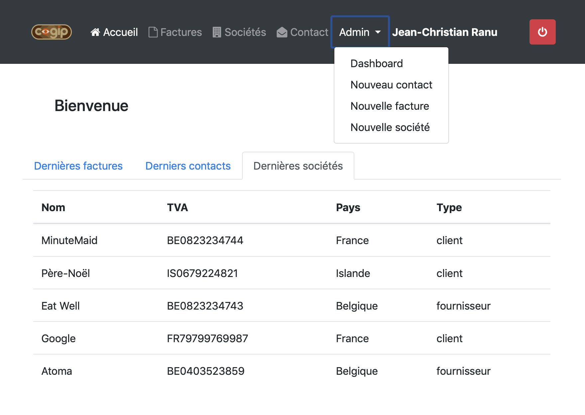

# COGIP-app

## Group project of [Broutin Jean-Marc](https://github.com/jmbroutin), [Kremers Audrey](https://github.com/AudreyKremers) and [Guy Djendo Essiko](https://github.com/Ho-Be-One).

*Exercice realized from 8 april 2019 to 12 april 2019, as a group project for the formation [BeCode](https://www.becode.org/) to be a Web Developper*

## Project

For this project, we have to realize an accounting web application for a fictive company named COGIP. To develop this application we have to use PHP and MySQL languages.

### Link to the complete instructions
https://github.com/becodeorg/BXL-Johnson-3.9/tree/master/Projets/COGIPapp

## Used Languages and technologies

* HTML5, CSS3, Bootstrap framework
* PHP
* MySQL,MySQL Workbench

## Screenshots

## Link to the Web Application
https://cogip-becode.000webhostapp.com/index.php

## How to use
In order to log into the web application you can use the following user accounts :

### Jean-Christian Ranu (godmode account):
login: Jean-Christian.Ranu@cogip.com
password: Ranu

### Muriel Perrache (modop account):
login: Muriel.Perrache@cogip.com
password: Perrache

### Elvis Presley (viewer account):
login: elvis.presley@cogip.com
password: Presley

